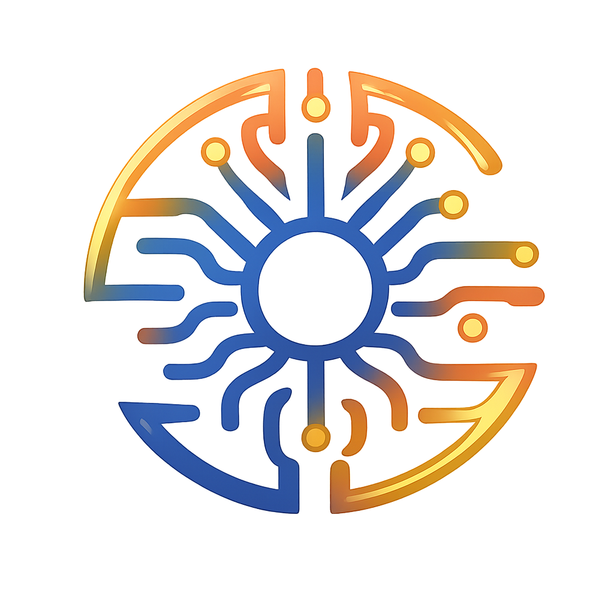

<p align="center">
  
</p>

<h1 align="center">🚀 Fusion Browse Assistant</h1>

<p align="center">
  <strong>Your AI copilot for smarter web browsing</strong>
</p>

<p align="center">
  
  
  
  
  
  
</p>

---

## 📖 Description

**Fusion Browse Assistant** is a Chrome/Edge/Brave extension that integrates an AI assistant directly into your browser. Powered by the Mistral API, it allows you to summarize, analyze, question, and transform the content of any web page.

> 🔒 **100% Private**: Your API key is stored locally on your browser. No data is sent to third-party servers.

---

## ✨ Features

### 💬 Smart Chat with Automatic Web Search
- Ask questions about page content
- **🔍 Automatic web search**: If the information isn't on the page, the assistant automatically searches the internet
- Get contextualized and sourced answers
- Persistent conversation history
- **Choose your AI model**: Mistral Large, Medium, Small, Nemo, or Codestral

### ⚙️ Settings Panel
- 🌍 **Language selector**: French, English, German, Spanish
- 🤖 **AI Model selector**: Choose the model that fits your needs
- 🔑 **API Key management**: Save, test, delete
- 🔄 **Update checker**: Automatic notification when a new version is available

### ⚡ Quick Actions

| Category | Actions |
|----------|---------|
| **📝 Summarization** | Quick summary, Detailed analysis, Simplified explanation |
| **🔍 Analysis** | Complete analysis, Key ideas highlighting, Data extraction |
| **✍️ Rewriting** | Scientific, Journalistic, Marketing, UX Copy, Twitter Thread, LinkedIn Post |
| **📊 Content Generation** | Article plan, YouTube script, Email sequence, Structured tutorial, **Contact email** |
| **🎬 YouTube** | Video summary, Key points, Transcript extraction + .txt download |

### 🎬 YouTube Integration
- **📺 Video Summary**: Detailed summary with chapters, key points, and takeaways
- **📌 Key Points**: Exhaustive extraction of all important points
- **📝 Transcript**: Real subtitle extraction with automatic .txt file download
  - Supports multiple languages (FR, EN priority)
  - AI-generated transcription fallback when subtitles unavailable
  - High token limits for long videos (16,000+ tokens)

### 🖍️ Smart Analysis
- **Automatic highlighting** of key ideas directly on the page
- **Data extraction** (tables → CSV, lists, key concepts)
- **Multi-tab comparison** with comparative table

### ✍️ Professional Rewriting
- 🔬 Scientific/Academic style
- 📰 Journalistic style
- 🎯 Marketing style
- 💻 UX Copy style
- 🐦 Twitter Thread
- 💼 LinkedIn Post

### 📊 Content Generation
- 📝 SEO article plan
- 🎬 YouTube video script
- 📧 Marketing email sequence
- 📖 Structured tutorial
- ✉️ **Contact email** with context analysis

### 📎 Google Integration
- Connect Google Docs, Sheets, and Slides
- Analyze and chat about document content
- Persistent chat history per document
- Content extraction from open tabs

### 🤖 Custom Agents
- Add your own Mistral agents by ID
- Dedicated chat with each agent
- Complete management (add, remove, organize)
- *Page Agent - Coming Soon*

### 🌐 Multilingual
Full support for:
- 🇫🇷 Français
- 🇬🇧 English
- 🇩🇪 Deutsch
- 🇪🇸 Español

Automatic language detection based on browser settings.

---

## 🌐 Browser Compatibility

| Browser | Compatible | Notes |
|---------|------------|-------|
| ✅ **Google Chrome** | Yes | Native support |
| ✅ **Microsoft Edge** | Yes | Chromium-based |
| ✅ **Brave** | Yes | Chromium-based |
| ✅ **Opera** | Yes | Chromium-based |
| ✅ **Vivaldi** | Yes | Chromium-based |

---

## 🎨 Interface

The extension features an elegant side panel inspired by Mistral design:

- 🌙 **Dark mode** with Mistral color palette (orange, yellow, red)
- 📱 **Responsive design** adapted to all screen sizes
- ✨ **Smooth animations** and glow effects
- 🎯 **Tab navigation**: Chat, Quick Actions, Agents, Integration

---

## 📦 Installation

### Developer Mode (Chrome/Edge/Brave)

1. **Download** or clone this repository
   ```bash
   git clone https://github.com/Noonran/Fusion-Ai_Assistant.git
   ```

2. **Open** the extensions page
   - Chrome: `chrome://extensions`
   - Edge: `edge://extensions`
   - Brave: `brave://extensions`

3. **Enable** developer mode (toggle in top right)

4. **Click** "Load unpacked extension"

5. **Select** the extension folder

6. **Configure** your Mistral API key in settings (⚙️)

---

## 🔑 API Key Configuration

1. Create an account on [console.mistral.ai](https://console.mistral.ai)
2. Generate an API key in the "API Keys" section
3. Open the extension and click ⚙️ (Settings)
4. Paste your key and click "Save"
5. Test the connection with the "Test" button
6. **Choose your preferred AI model**

---

## 📁 Project Structure

```
Fusion-Ai_Assistant/
├── manifest.json        # Manifest V3 configuration
├── background.js        # Service Worker (API, business logic)
├── contentScript.js     # Injected user interface
├── popup.html/js/css    # Extension popup
├── CONTRIBUTING.md      # Contribution guidelines
├── LICENSE              # AGPL-3.0 License
└── images/              # Visual resources
    ├── fusionai.png     # Fusion AI logo (app)
    ├── mistral.png      # Mistral logo (chat)
    ├── icon_agent.png   # Agent icon
    └── icon_*.png       # Extension icons (16, 32, 48, 128)
```

---

## 🛡️ Security & Privacy

- ✅ API key stored **locally only** (`chrome.storage.local`)
- ✅ **No third-party servers** - Direct communication with Mistral API
- ✅ **No personal data collection**
- ✅ **Open source** and auditable code

---

## 🔧 Required Permissions

| Permission | Usage |
|------------|-------|
| `storage` | Local storage of API key, model, and preferences |
| `activeTab` | Access to active tab content |
| `scripting` | Side panel injection |
| `contextMenus` | Right-click menu for quick actions |

---

## 🚀 Roadmap

- [ ] Automatic light/dark mode
- [ ] Conversation save & export
- [ ] Customizable keyboard shortcuts
- [ ] Multi-device synchronization
- [ ] Page Agent (interactive page analysis)
- [ ] Firefox compatibility

---

## 🤝 Contributing

Contributions are welcome! See [CONTRIBUTING.md](CONTRIBUTING.md) for guidelines.

1. Fork the project
2. Create a branch (`git checkout -b feature/new-feature`)
3. Commit your changes (`git commit -m 'Add new feature'`)
4. Push to the branch (`git push origin feature/new-feature`)
5. Open a Pull Request

---

## 📄 License

This project is open-source under the **[AGPL-3.0](License/LICENSE)** license.

- ✅ Any use, redistribution, or integration must comply with AGPL-3.0
- ✅ Modifications must be published under the same license
- ❌ Any **non-open-source** commercial use requires a commercial license

### 🔒 Fusion AI Commercial License

Companies can obtain:
- An internal non-open-source usage license
- A commercial product integration license
- Professional support and premium features

➡️ **Commercial contact**: vincent.manrique@fusion-ai.tech

See [LICENSE_COMMERCIAL.md](License/LICENSE_COMMERCIAL.md) for more details.

---

## 👨‍💻 Developed by

<p align="center">
  <strong>🔥 Fusion AI 🔥</strong>
</p>

<p align="center">
  <em>Creating innovative AI tools to boost your productivity</em>
</p>

<p align="center">
  📧 <a href="mailto:vincent.manrique@fusion-ai.tech">vincent.manrique@fusion-ai.tech</a>
</p>

---

<p align="center">
  <strong>⭐ If you like this project, don't hesitate to give it a star! ⭐</strong>
</p>
